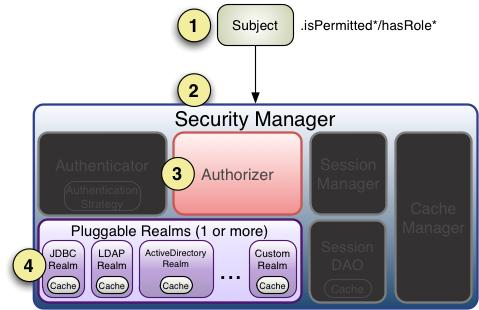

# 授权

[TOC]

## 3.1 名词解释

授权，也叫访问控制，即在应用中控制谁能访问哪些资源（如访问页面/编辑数据/页面操作
等）。在授权中需了解的几个关键对象：主体（Subject）、资源（Resource）、权限（Permission）、
角色（Role）。

+ 主体

主体，即访问应用的用户，在 Shiro 中使用 Subject 代表该用户。用户只有授权后才允许访
问相应的资源。

+ 资源

在应用中用户可以访问的任何东西，比如访问 JSP 页面、查看/编辑某些数据、访问某个业
务方法、打印文本等等都是资源。用户只要授权后才能访问。

+ 权限

安全策略中的原子授权单位，通过权限我们可以表示在应用中用户有没有操作某个资源的
权力。即权限表示在应用中用户能不能访问某个资源，如：
访问用户列表页面
查看/新增/修改/删除用户数据（即很多时候都是 CRUD（增查改删）式权限控制）
打印文档等等。。。

Shiro 支持粗粒度权限（如用户模块的所有权限）和细粒度权限（操作某个用户的权限，即
实例级别的）。

+ 角色

角色代表了操作集合，可以理解为权限的集合，一般情况下我们会赋予用户角色而不是权
限，即这样用户可以拥有一组权限，赋予权限时比较方便。典型的如：项目经理、技术总
监、CTO、开发工程师等都是角色，不同的角色拥有一组不同的权限。

**隐 式 角色**：即直接通过角色来验证用户有没有操作权限，如在应用中 CTO、技术总监、开
发工程师可以使用打印机，假设某天不允许开发工程师使用打印机，此时需要从应用中删
除相应代码；再如在应用中 CTO、技术总监可以查看用户、查看权限；突然有一天不允许
技术总监查看用户、查看权限了，需要在相关代码中把技术总监角色从判断逻辑中删除掉；
即粒度是以角色为单位进行访问控制的，粒度较粗；如果进行修改可能造成多处代码修改。

**显示角色**：在程序中通过权限控制谁能访问某个资源，角色聚合一组权限集合；这样假设
哪个角色不能访问某个资源，只需要从角色代表的权限集合中移除即可；无须修改多处代
码；即粒度是以资源/实例为单位的；粒度较细。

## 3.2  授权方式

Shiro 支持三种方式的授权：

+ 编程式：通过写 if/else 授权代码块完成：

  ```java
  Subject subject = SecurityUtils.getSubject();
  if(subject.hasRole(“admin”)) {
  //有权限
  } else {
  //无权限
  }
  ```

  ​

+ 注解式：通过在执行的 Java 方法上放置相应的注解完成：

```java
@RequiresRoles("admin")
public void hello() {
//有权限
}
```

没有权限将抛出相应的异常；

+ JSP/GSP 标签：在 JSP/GSP 页面通过相应的标签完成：

```jsp
<shiro:hasRole name="admin">
<!— 有权限 —>
</shiro:hasRole>
```

## 3.3 授权

+ 基于角色 的 访问 控制 （隐 式 角色）

1. ini配置角色（shiro-role.ini）

```ini
[users]
zhang=123,role1,role2
wang=123,role1

```

规则即：“用户名=密码,角色 1，角色 2”，如果需要在应用中判断用户是否有相应角色，
就需要在相应的 Realm 中返回角色信息，也就是说 Shiro 不负责维护用户-角色信息，需要
应用提供，Shiro 只是提供相应的接口方便验证，后续会介绍如何动态的获取用户角色。

2. 测试

```java
  @Test
    public void testHasRole(){
        login("classpath:shiro-role.ini", "zhang", "123");
        //判断拥有角色：role1
        Assert.assertTrue(subject().hasRole("role1"));
        //判断拥有角色：role1 and role2
        Assert.assertTrue(subject().hasAllRoles(Arrays.asList("role1", "role2")));
        //判断拥有角色：role1 and role2 and !role3
        boolean[] result = subject().hasRoles(Arrays.asList("role1", "role2", "role3"));
        Assert.assertEquals(true, result[0]);
        Assert.assertEquals(true, result[1]);
        Assert.assertEquals(false, result[2]);
    }
```

Shiro 提供了 hasRole/hasRole 用于判断用户是否拥有某个角色/某些权限；但是没有提供如
hashAnyRole 用于判断是否有某些权限中的某一个。

```java
@Test(expected = UnauthorizedException.class)
    public void testCheckRole(){
        login("classpath:shiro-role.ini", "zhang", "123");
        //断言拥有角色：role1
        subject().checkRole("role1");
        //断言拥有角色：role1 and role3 失败抛出异常
        subject().checkRoles("role1", "role3");
    }
```

Shiro 提供的 checkRole/checkRoles 和 hasRole/hasAllRoles 不同的地方是它在判断为假的情
况下会抛出 UnauthorizedException 异常。

到此基于角色的访问控制（即隐式角色）就完成了，这种方式的缺点就是如果很多地方进
行了角色判断，但是有一天不需要了那么就需要修改相应代码把所有相关的地方进行删除；
这就是粗粒度造成的问题。

+ 基于资源 的 访问 控制 （显示角色）

1. 在 ini 配置文件配置用户拥有的角色及角色-权限关系（shiro-permission.ini）

```ini
[users]
zhang=123,role1,role2
wang=123,role1
li=123,role41,role42,role51,role52,role53,role61,role62,role71,role72,role73,role74,role75,role81,role82


[roles]
#对资源user拥有create、update权限
role1=user:create,user:update
#对资源user拥有create、delete权限
role2=user:create,user:delete
#对资源user拥有create权限
role3=system:user:create

#对资源user拥有update、delete权限
role41=system:user:update,system:user:delete
#对资源user拥有update、delete权限（简写，但不等价）
role42="system:user:update,delete"

#对资源system:user拥有create、update、delete、view权限
role51="system:user:create,update,delete,view"
#对资源system:user拥有所有权限
role52=system:user:*
#对资源system:user拥有所有权限
role53=system:user

#对资源拥有所有权限（如匹配user:view）
role61=*:view
#对资源拥有所有权限（如匹配system:user:view，即和之上的不等价）
role62=*:*:view

#对资源user的1实例拥有view权限
role71=user:view:1
#对资源user的1实例拥有update、delete权限
role72="user:update,delete:1"
#对资源user的1实例拥有所有权限
role73=user:*:1
#对资源user的所有实例拥有auth权限
role74=user:auth:*
#对资源user的所有实例拥有所有权限
role75=user:*:*

#等价于menu:*:*
role81=menu:*
role82=organization

```

规则：“用户名=密码，角色 1，角色 2” “角色=权限 1，权限 2”，即首先根据用户名找
到角色，然后根据角色再找到权限；即角色是权限集合；Shiro 同样不进行权限的维护，需
要我们通过 Realm 返回相应的权限信息。只需要维护“用户——角色”之间的关系即可。

2. 测试

```java
    @Test
    public void testIsPermitted() {
        login("classpath:shiro-permission.ini", "zhang", "123");
        //判断拥有权限：user:create
        Assert.assertTrue(subject().isPermitted("user:create"));
        //判断拥有权限：user:update and user:delete
        Assert.assertTrue(subject().isPermittedAll("user:update", "user:delete"));
        //判断没有权限：user:view
        Assert.assertFalse(subject().isPermitted("user:view"));
    }
```

Shiro 提供了 isPermitted 和 isPermittedAll 用于判断用户是否拥有某个权限或所有权限，也
没有提供如 isPermittedAny 用于判断拥有某一个权限的接口。

```java
@Test(expected = UnauthorizedException.class)
    public void testCheckPermission() {
        login("classpath:shiro-permission.ini", "zhang", "123");
        //断言拥有权限：user:create
        subject().checkPermission("user:create");
        //断言拥有权限：user:delete and user:update
        subject().checkPermissions("user:delete", "user:update");
        //断言拥有权限：user:view 失败抛出异常
        subject().checkPermissions("user:view");
    }
```

到此基于资源的访问控制（显示角色）就完成了，也可以叫基于权限的访问控制，这种方式的一般规则是“资源标识符：操作”，即是资源级别的粒度；这种方式的好处就是如果要修改基本都是一个资源级别的修改，不会对其他模块代码产生影响，粒度小。但是实现起来可能稍微复杂点，需要维护“用户——角色，角色——权限（资源：操作）”之间的关系。

## 3.4 权限Permission

**字符串通 配符权限**
规则：“资源标识符：操作：对象实例 ID” 即对哪个资源的哪个实例可以进行什么操作。
其默认支持通配符权限字符串，“:”表示资源/操作/实例的分割；“,”表示操作的分割；
“*”表示任意资源/操作/实例。

### 3.4.1 单个资源单个权限

```java
subject().checkPermissions("system:user:update");
```

用户拥有资源“system:user”的“update”权限。

### 3.4.2 单 个资源多个权限

```ini
role41=system:user:update,system:user:delete
```

代码判断

```java
subject().checkPermissions("system:user:update", "system:user:delete");
```

用户拥有资源“system:user”的“update”和“delete”权限。如上可以简写成：ini 配置（表示角色 4 拥有 system:user 资源的 update 和 delete 权限）

```ini
role42="system:user:update,delete"
```

代码判断

```java
subject().checkPermissions("system:user:update,delete");
```

通过“system:user:update,delete”验证"system:user:update, system:user:delete"是没问题的，
但是反过来是规则不成立。

### 3.4.3 单个资源全部权限

```ini
role51="system:user:create,update,delete,view"
```

代码判断

```java
subject().checkPermissions("system:user:create,delete,update:view");
```

用户拥有资源“system:user”的“create”、“update”、“delete”和“view”所有权限。
如上可以简写成：
ini 配置文件（表示角色 5 拥有 system:user 的所有权限）

```ini
role52=system:user:*
```

然后通过如下代码判断

```java
subject().checkPermissions("system:user:create,delete,update:view");
```

用户拥有资源“system:user”的“create”、“update”、“delete”和“view”所有权限。
如上可以简写成：
ini 配置文件（表示角色 5 拥有 system:user 的所有权限）

```ini
role52=system:user:*
```

或者

```ini
role53=system:user
```

代码判断

```java
subject().checkPermissions("system:user:*");
subject().checkPermissions("system:user");
```

通过“system:user:*”验证“system:user:create,delete,update:view”可以，但是反过来是不
成立的。

### 3.4.4所有资源的全部权限

```ini
role61=*:view
```

代码判断：

```java
subject().checkPermissions("user:view");
```

用户拥有所有资源的“view”所有权限。假设判断的权限是“"system:user:view”，那么需
要“role5=*:*:view”这样写才行。

### 3.4.5 实例 级别的权限

+ 单个实例单个权限

```ini
role71=user:view:1
```

对资源 user 的 1 实例拥有 view 权限代码判断

```java
subject().checkPermissions("user:view:1");
```

+ 单个实例多个权限

```ini
role72="user:update,delete:1"
```

对资源 user 的 1 实例拥有 update、delete 权限代码判断

```java
subject().checkPermissions("user:delete,update:1");
subject().checkPermissions("user:update:1", "user:delete:1");
```


+ 单个实力所有权限

```ini
role73=user:*:1
```

对资源 user 的 1 实例拥有所有权限代码判断

```java
subject().checkPermissions("user:update:1", "user:delete:1", "user:view:1");
```

+ 所有实例单个权限

```ini
role74=user:auth:*
```

对资源 user 的 1 实例拥有所有权限代码判断

```java
subject().checkPermissions("user:auth:1", "user:auth:2");
```

+ 所有实例所有权限

```ini
role75=user:*:*
```

对资源 user 的 1 实例拥有所有权限代码判断

```java
subject().checkPermissions("user:view:1", "user:auth:2");
```

### 3.4.6 Shiro 对权限 字符串缺失部分的处理

如“user:view”等价于“user:view:*”；而“organization”等价于“organization:*”或者
“organization:*:*”。可以这么理解，这种方式实现了前缀匹配。
另外如“user:*”可以匹配如“user:delete”、“user:delete”可以匹配如“user:delete:1”、
“user:*:1”可以匹配如“user:view:1”、“user”可以匹配“user:view”或“user:view:1”
等。即*可以匹配所有，不加*可以进行前缀匹配；但是如“*:view”不能匹配
“system:user:view”，需要使用“*:*:view”，即后缀匹配必须指定前缀（多个冒号就需要
多个*来匹配）。

### 3.4.7  WildcardPermission

如下两种方式是等价的

```java
subject().checkPermission("menu:view:1");
subject().checkPermission(new WildcardPermission("menu:view:1"));
```

### 3.4.8 性能

通配符匹配方式比字符串相等匹配来说是更复杂的，因此需要花费更长时间，但是一般系
统的权限不会太多，且可以配合缓存来提供其性能，如果这样性能还达不到要求我们可以
实现位操作算法实现性能更好的权限匹配。另外实例级别的权限验证如果数据量太大也不
建议使用，可能造成查询权限及匹配变慢。可以考虑比如在 sql 查询时加上权限字符串之
类的方式在查询时就完成了权限匹配。

## 3.5 授权流程



流程如下：

1. 首先调用 Subject.isPermitted*/hasRole*接口，其会委托给 SecurityManager，而

SecurityManager 接着会委托给 Authorizer；

2. Authorizer 是真正的授权者，如果我们调用如 isPermitted(“user:view”)，其首先会通过

PermissionResolver 把字符串转换成相应的 Permission 实例；

3. 在进行授权之前，其会调用相应的 Realm 获取 Subject 相应的角色/权限用于匹配传入的

角色/权限；

4. Authorizer 会判断 Realm 的角色/权限是否和传入的匹配，如果有多个 Realm，会委托给

ModularRealmAuthorizer 进行循环判断，如果匹配如 isPermitted*/hasRole*会返回 true，否
则返回 false 表示授权失败。


ModularRealmAuthorizer 进行多 Realm 匹配流程：
1、首先检查相应的 Realm 是否实现了实现了 Authorizer；
2、如果实现了 Authorizer，那么接着调用其相应的 isPermitted*/hasRole*接口进行匹配；
3、如果有一个 Realm 匹配那么将返回 true，否则返回 false。

如果 Realm 进行授权的话，应该继承 AuthorizingRealm，其流程是：
1.1、如果调用 hasRole*，则直接获取 AuthorizationInfo.getRoles()与传入的角色比较即可；
1.2、首先如果调用如 isPermitted(“user:view”)，首先通过 PermissionResolver 将权限字符串
转换成相应的 Permission 实例，默认使用 WildcardPermissionResolver，即转换为通配符的
WildcardPermission；

2 、 通 过 AuthorizationInfo.getObjectPermissions() 得 到 Permission 实 例 集 合 ； 通 过
AuthorizationInfo. getStringPermissions()得到字符串集合并通过 PermissionResolver 解析为
Permission 实例；然后获取用户的角色，并通过 RolePermissionResolver 解析角色对应的权
限集合（默认没有实现，可以自己提供）；
3、接着调用 Permission. implies(Permission p)逐个与传入的权限比较，如果有匹配的则返回
true，否则 false。

## 3.6 Authorizer、PermissionResolver 及RolePermissionResolver

Authorizer 的职责是进行授权（访问控制），是 Shiro API 中授权核心的入口点，其提供了
相应的角色/权限判断接口，具体请参考其 Javadoc。SecurityManager 继承了 Authorizer 接
口，且提供了 ModularRealmAuthorizer 用于多 Realm 时的授权匹配。PermissionResolver 用
于解析权限字符串到 Permission 实例，而 RolePermissionResolver 用于根据角色解析相应的
权限集合。
我们可以通过如下 ini 配置更改 Authorizer 实现：

```ini
authorizer=org.apache.shiro.authz.ModularRealmAuthorizer
securityManager.authorizer=$authorizer
```

对于 ModularRealmAuthorizer，相应的 AuthorizingSecurityManager 会在初始化完成后自动
将相应的 realm 设置进去，我们也可以通过调用其 setRealms()方法进行设置。对于实现自
己的 authorizer 可以参考 ModularRealmAuthorizer 实现即可，在此就不提供示例了。
设置 ModularRealmAuthorizer 的 permissionResolver，其会自动设置到相应的 Realm 上（其
实现了 PermissionResolverAware 接口），如：

```ini
permissionResolver=org.apache.shiro.authz.permission.WildcardPermissionResolver
authorizer.permissionResolver=$permissionResolver
```

设置 ModularRealmAuthorizer 的 rolePermissionResolver，其会自动设置到相应的 Realm 上
（其实现了 RolePermissionResolverAware 接口），如：

```ini
rolePermissionResolver=com.github.zhangkaitao.shiro.chapter3.permission.MyRolePermissionResolver
authorizer.rolePermissionResolver=$rolePermissionResolver
```

**示例**

+ ini配置

```ini
[main]
#自定义authorizer
authorizer=org.apache.shiro.authz.ModularRealmAuthorizer
#自定义permissionResolver
#permissionResolver=com.xc.permission.WildcardPermissionResolver
permissionResolver=com.xc.permission.BitAndWildPermissionResolver
authorizer.permissionResolver=$permissionResolver
#自定义rolePermissionResolver
rolePermissionResolver=com.xc.permission.MyRolePermissionResolver
authorizer.rolePermissionResolver=$rolePermissionResolver

securityManager.authorizer=$authorizer

#自定义realm 一定要放在securityManager.authorizer赋值之后（因为调用setRealms会将realms设置给authorizer，并给各个Realm设置permissionResolver和rolePermissionResolver）
realm=com.xc.realm.MyRealm
securityManager.realms=$realm
```

>自定义 realm 一定要放在 securityManager.authorizer 赋值之后（因为调用 setRealms 会将
>realms设置给authorizer，并给各个Realm设置permissionResolver和rolePermissionResolver）
>realm=com.github.zhangkaitao.shiro.chapter3.realm.MyRealm
>securityManager.realms=$realm

设置 securityManager 的 realms 一定要放到最后，因为在调用 SecurityManager.setRealms 时
会 将 realms 设 置 给 authorizer ， 并 为 各 个 Realm 设 置 permissionResolver 和
rolePermissionResolver。另外，不能使用 IniSecurityManagerFactory 创建的 IniRealm，因为
其初始化顺序的问题可能造成后续的初始化 Permission 造成影响。

+ 定义 BitAndWildPermissionResolver 及 BitPermission

BitPermission 用于实现位移方式的权限，如规则是：
权限字符串格式：+资源字符串+权限位+实例 ID；以+开头 中间通过+分割；权限：0 表示
所有权限；1 新增（二进制：0001）、2 修改（二进制：0010）、4 删除（二进制：0100）、
8 查看（二进制：1000）；如 +user+10 表示对资源 user 拥有修改/查看权限。

```java
public class BitPermission implements Permission {

    private String resourceIdentify;
    private int permissionBit;
    private String instanceId;

    public BitPermission(String permissionString) {
        String[] array = permissionString.split("\\+");

        if(array.length > 1) {
            resourceIdentify = array[1];
        }

        if(StringUtils.isEmpty(resourceIdentify)) {
            resourceIdentify = "*";
        }

        if(array.length > 2) {
            permissionBit = Integer.valueOf(array[2]);
        }

        if(array.length > 3) {
            instanceId = array[3];
        }

        if(StringUtils.isEmpty(instanceId)) {
            instanceId = "*";
        }

    }

    @Override
    public boolean implies(Permission p) {
        if(!(p instanceof BitPermission)) {
            return false;
        }
        BitPermission other = (BitPermission) p;

        if(!("*".equals(this.resourceIdentify) || this.resourceIdentify.equals(other.resourceIdentify))) {
            return false;
        }

        if(!(this.permissionBit ==0 || (this.permissionBit & other.permissionBit) != 0)) {
            return false;
        }

        if(!("*".equals(this.instanceId) || this.instanceId.equals(other.instanceId))) {
            return false;
        }
        return true;
    }

    @Override
    public String toString() {
        return "BitPermission{" +
                "resourceIdentify='" + resourceIdentify + '\'' +
                ", permissionBit=" + permissionBit +
                ", instanceId='" + instanceId + '\'' +
                '}';
    }
}
```

BitAndWildPermissionResolver 实现了 PermissionResolver 接口，并根据权限字符串是否以
“+”开头来解析权限字符串为 BitPermission 或 WildcardPermission。

```java
public class BitAndWildPermissionResolver implements PermissionResolver {

    @Override
    public Permission resolvePermission(String permissionString) {
        if(permissionString.startsWith("+")) {
            return new BitPermission(permissionString);
        }
        return new WildcardPermission(permissionString);
    }
}
```

+ 定义 MyRolePermissionResolver

RolePermissionResolver 用于根据角色字符串来解析得到权限集合。

```java
public class MyRolePermissionResolver implements RolePermissionResolver {
    @Override
    public Collection<Permission> resolvePermissionsInRole(String roleString) {
        if("role1".equals(roleString)) {
            return Arrays.asList((Permission)new WildcardPermission("menu:*"));
        }
        return null;
    }
}
```

此处的实现很简单，如果用户拥有 role1，那么就返回一个“menu:*”的权限。

+ 自定义 Realm

```java
public class MyRealm extends AuthorizingRealm {
    @Override
    protected AuthorizationInfo doGetAuthorizationInfo(PrincipalCollection principalCollection) {

        SimpleAuthorizationInfo authorizationInfo = new SimpleAuthorizationInfo();
        authorizationInfo.addRole("role1");
        authorizationInfo.addRole("role2");
        authorizationInfo.addObjectPermission(new BitPermission("+user1+10"));
        authorizationInfo.addObjectPermission(new WildcardPermission("user1:*"));
        authorizationInfo.addStringPermission("+user2+10");
        authorizationInfo.addStringPermission("user2:*");
        return authorizationInfo;
    }

    @Override
    protected AuthenticationInfo doGetAuthenticationInfo(AuthenticationToken token) throws AuthenticationException {
        String username = (String) token.getPrincipal();  //得到用户名
        String password = new String((char[]) token.getCredentials()); //得到密码
        if (!"zhang".equals(username)) {
            throw new UnknownAccountException(); //如果用户名错误
        }
        if (!"123".equals(password)) {
            throw new IncorrectCredentialsException(); //如果密码错误
        }
        //如果身份认证验证成功，返回一个AuthenticationInfo实现；
        return new SimpleAuthenticationInfo(username, password, getName());
    }
}
```

此时我们继承 AuthorizingRealm 而不是实现 Realm 接口；推荐使用 AuthorizingRealm，因
为：
AuthenticationInfo doGetAuthenticationInfo(AuthenticationToken token)：表示获取身份验证信
息；
AuthorizationInfo doGetAuthorizationInfo(PrincipalCollection principals)：表示根据用户身份
获取授权信息。
这种方式的好处是当只需要身份验证时只需要获取身份验证信息而不需要获取授权信息。
对于 AuthenticationInfo 和 AuthorizationInfo 请参考其 Javadoc 获取相关接口信息。

此次还要注意就是不能把我们自定义的如“+user1+10”配置到 INI 配置文件，即使有IniRealm 完成，因为 IniRealm 在 new 完成后就会解析这些权限字符串，默认使用了WildcardPermissionResolver 完成，即此处是一个设计权限，如果采用生命周期（如使用初始化方法）的方式进行加载就可以解决我们自定义permissionResolver 的问题。

+ 测试

```java
@Test
public void testIsPermitted(){
    login("classpath:shiro-authorizer.ini", "zhang", "123");
    //判断拥有权限：user:create
    Assert.assertTrue(subject().isPermitted("user1:update"));
    Assert.assertTrue(subject().isPermitted("user2:update"));
    //通过二进制位的方式表示权限
    Assert.assertTrue(subject().isPermitted("+user1+2"));//新增权限
    Assert.assertTrue(subject().isPermitted("+user1+8"));//查看权限
    Assert.assertTrue(subject().isPermitted("+user2+10"));//新增及查看

    Assert.assertFalse(subject().isPermitted("+user1+4"));//没有删除权限

    Assert.assertTrue(subject().isPermitted("menu:view"));//通过MyRolePermissionResolver解析得到的权限
}
```