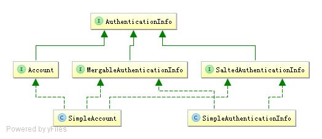
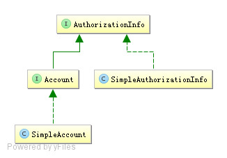
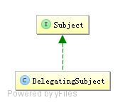

# Realm 及相关对象

## 6.1 Realm

### 6.1.1 定义实体及关系


即用户-角色之间是多对多关系，角色-权限之间是多对多关系；且用户和权限之间通过角
色建立关系；在系统中验证时通过权限验证，角色只是权限集合，即所谓的显示角色；其
实权限应该对应到资源（如菜单、URL、页面按钮、Java 方法等）中，即应该将权限字符
串存储到资源实体中，但是目前为了简单化，直接提取一个权限表，【综合示例】部分会
使用完整的表结构。

用户实体包括：编号(id)、用户名(username)、密码(password)、盐(salt)、是否锁定(locked)；
是否锁定用于封禁用户使用，其实最好使用 Enum 字段存储，可以实现更复杂的用户状态
实现。
角色实体包括：编号(id)、角色标识符（role）、描述（description）、是否可用（available）；
其中角色标识符用于在程序中进行隐式角色判断的，描述用于以后再前台界面显示的、是
否可用表示角色当前是否激活。
权限实体包括：编号（id）、权限标识符（permission）、描述（description）、是否可用（available）；
含义和角色实体类似不再阐述。
另外还有两个关系实体：用户-角色实体（用户编号、角色编号，且组合为复合主键）；角
色-权限实体（角色编号、权限编号，且组合为复合主键）

SQL:

```mssql
create table sys_users (
  id bigint auto_increment,
  username varchar(100),
  password varchar(100),
  salt varchar(100),
  locked bool default false,
  constraint pk_sys_users primary key(id)
) charset=utf8 ENGINE=InnoDB;
create unique index idx_sys_users_username on sys_users(username);

create table sys_roles (
  id bigint auto_increment,
  role varchar(100),
  description varchar(100),
  available bool default false,
  constraint pk_sys_roles primary key(id)
) charset=utf8 ENGINE=InnoDB;
create unique index idx_sys_roles_role on sys_roles(role);

create table sys_permissions (
  id bigint auto_increment,
  permission varchar(100),
  description varchar(100),
  available bool default false,
  constraint pk_sys_permissions primary key(id)
) charset=utf8 ENGINE=InnoDB;
create unique index idx_sys_permissions_permission on sys_permissions(permission);

create table sys_users_roles (
  user_id bigint,
  role_id bigint,
  constraint pk_sys_users_roles primary key(user_id, role_id)
) charset=utf8 ENGINE=InnoDB;

create table sys_roles_permissions (
  role_id bigint,
  permission_id bigint,
  constraint pk_sys_roles_permissions primary key(role_id, permission_id)
) charset=utf8 ENGINE=InnoDB;
```

### 6.1.2 环境准备

pox.xml

```xml
<dependency>
            <groupId>net.sf.ehcache</groupId>
            <artifactId>ehcache-core</artifactId>
            <version>2.6.11</version>
        </dependency>
        <dependency>
            <groupId>org.springframework</groupId>
            <artifactId>spring-jdbc</artifactId>
            <version>4.1.6.RELEASE</version>
        </dependency>
```

###  6.1.3 定义DAO service

**PermissionService**

```java
public interface PermissionService {
public Permission createPermission(Permission permission);
public void deletePermission(Long permissionId);
}
```

实现基本的创建/删除权限。

**RoleService**

相对于 PermissionService 多了关联/移除关联角色-权限功能

```java
public interface RoleService {
public Role createRole(Role role);
public void deleteRole(Long roleId);
//添加角色-权限之间关系
public void correlationPermissions(Long roleId, Long... permissionIds);
//移除角色-权限之间关系
public void uncorrelationPermissions(Long roleId, Long... permissionIds);//
}
```

相对于 PermissionService 多了关联/移除关联角色-权限功能

**UserService**

```java
public interface UserService {
public User createUser(User user); //创建账户
public void changePassword(Long userId, String newPassword);//修改密码
public void correlationRoles(Long userId, Long... roleIds); //添加用户-角色关系
public void uncorrelationRoles(Long userId, Long... roleIds);// 移除用户-角色关系
public User findByUsername(String username);// 根据用户名查找用户
public Set<String> findRoles(String username);// 根据用户名查找其角色
public Set<String> findPermissions(String username); //根据用户名查找其权限
}
```

此处使用 findByUsername、findRoles 及 findPermissions 来查找用户名对应的帐号、角色及
权限信息。之后的 Realm 就使用这些方法来查找相关信息。


### 6.1.4 定义Realm

userRealm

```java
public class UserRealm extends AuthorizingRealm {

    private UserService userService = new UserServiceImpl();

    @Override
    protected AuthorizationInfo doGetAuthorizationInfo(PrincipalCollection principals) {
        String username = (String) principals.getPrimaryPrincipal();

        SimpleAuthorizationInfo authorizationInfo = new SimpleAuthorizationInfo();
        authorizationInfo.setRoles(userService.findRoles(username));
        authorizationInfo.setStringPermissions(userService.findPermissions(username));

        return authorizationInfo;
    }

    @Override
    protected AuthenticationInfo doGetAuthenticationInfo(AuthenticationToken token) throws AuthenticationException {

        String username = (String) token.getPrincipal();

        User user = userService.findByUsername(username);

        if (user == null) {
            throw new UnknownAccountException();//没找到帐号
        }

        if (Boolean.TRUE.equals(user.getLocked())) {
            throw new LockedAccountException(); //帐号锁定
        }

        //交给AuthenticatingRealm使用CredentialsMatcher进行密码匹配，如果觉得人家的不好可以自定义实现
        SimpleAuthenticationInfo authenticationInfo = new SimpleAuthenticationInfo(
                user.getUsername(), //用户名
                user.getPassword(), //密码
                ByteSource.Util.bytes(user.getCredentialsSalt()),//salt=username+salt
                getName()  //realm name
        );
        return authenticationInfo;
    }
}

```

1 、UserRealm 父类 AuthorizingRealm 将获取 Subject 相关 信息 分成 两 步：获取身份验证信息（doGetAuthenticationInfo）及授权信息（doGetAuthorizationInfo）；
2 、doGetAuthenticationInfo 获取身份验证相关 信息：首先根据传入的用户名获取 User 信
息；然后如果 user 为空，那么抛出没找到帐号异常 UnknownAccountException；如果 user
找到但锁定了抛出锁定异常 LockedAccountException；最后生成 AuthenticationInfo 信息，
交给间接父类 AuthenticatingRealm 使用 CredentialsMatcher 进行判断密码是否匹配，如果不
匹配将抛出密码错误异常 IncorrectCredentialsException；另外如果密码重试此处太多将抛出
超出重试次数异常 ExcessiveAttemptsException；在组装 SimpleAuthenticationInfo 信息时，
需要传入：身份信息（用户名）、凭据（密文密码）、盐（username+salt），CredentialsMatcher
使用盐加密传入的明文密码和此处的密文密码进行匹配。
3 、doGetAuthorizationInfo 获取授权信息：PrincipalCollection 是一个身份集合，因为我们
现在就一个 Realm，所以直接调用 getPrimaryPrincipal 得到之前传入的用户名即可；然后根
据用户名调用 UserService 接口获取角色及权限信息。

### 6.1.5 测试

参考：com.xc.realm.UserRealmTest

## 6.2 AuthenticationToken


AuthenticationToken 用于收集用户提交的身份（如用户名）及凭据（如密码）：

```java
public interface AuthenticationToken extends Serializable {
Object getPrincipal(); //身份
Object getCredentials(); //凭据
}
```

扩展接口 RememberMeAuthenticationToken：提供了“boolean isRememberMe()”现“记住我”的功能；

扩展接口是 HostAuthenticationToken：提供了“String getHost()”方法用于获取用户“主机”
的功能。

Shiro 提供了一个直接拿来用的 UsernamePasswordToken，用于实现用户名/密码 Token 组，
另外其实现了 RememberMeAuthenticationToken 和 HostAuthenticationToken，可以实现记住
我及主机验证的支持。

## 6.3 AuthenticationInfo



AuthenticationInfo 有两个作用：
1、如果 Realm 是 AuthenticatingRealm 子类，则提供给 AuthenticatingRealm 内部使用的
CredentialsMatcher 进行凭据验证； （如果没有继承它需要在自己的 Realm中自己实现验证）；
2、提供给 SecurityManager 来创建 Subject（提供身份信息）；
MergableAuthenticationInfo 用于提供在多 Realm 时合并 AuthenticationInfo 的功能，主要合
并 Principal、如果是其他的如 credentialsSalt，会用后边的信息覆盖前边的。
比 如 HashedCredentialsMatcher ， 在 验 证 时 会 判 断 AuthenticationInfo 是 否 是
SaltedAuthenticationInfo 子类，来获取盐信息。
Account相当于我们之前的User，SimpleAccount是其一个实现；在IniRealm、PropertiesRealm
这种静态创建帐号信息的场景中使用，这些 Realm 直接继承了 SimpleAccountRealm，而
SimpleAccountRealm 提供了相关的 API 来动态维护 SimpleAccount；即可以通过这些 API
来动态增删改查 SimpleAccount；动态增删改查角色/权限信息。及如果您的帐号不是特别
多，可以使用这种方式，具体请参考 SimpleAccountRealm Javadoc。
其他情况一般返回 SimpleAuthenticationInfo 即可。

## 6.4 PrincipalCollection


因为我们可以在 Shiro 中同时配置多个 Realm，所以呢身份信息可能就有多个；因此其提供
了 PrincipalCollection 用于聚合这些身份信息：

```java
public interface PrincipalCollection extends Iterable, Serializable {
Object getPrimaryPrincipal(); //得到主要的身份
<T> T oneByType(Class<T> type); //根据身份类型获取第一个
<T> Collection<T> byType(Class<T> type); //根据身份类型获取一组
List asList(); //转换为 List
Set asSet(); //转换为 Set
Collection fromRealm(String realmName); //根据 Realm 名字获取
Set<String> getRealmNames(); //获取所有身份验证通过的 Realm 名字
boolean isEmpty(); //判断是否为空
}
```

因为 PrincipalCollection 聚合了多个，此处最需要注意的是 getPrimaryPrincipal，如果只有一
个 Principal 那么直接返回即可，如果有多个 Principal，则返回第一个（因为内部使用 Map
存储，所以可以认为是返回任意一个）；oneByType / byType 根据凭据的类型返回相应的
Principal；fromRealm 根据 Realm 名字（每个 Principal 都与一个 Realm 关联）获取相应的
Principal。

MutablePrincipalCollection 是一个可变的 PrincipalCollection 接口，即提供了如下可变方法：

```java
public interface MutablePrincipalCollection extends PrincipalCollection {
void add(Object principal, String realmName); //添加 Realm-Principal 的关联
void addAll(Collection principals, String realmName); //添加一组 Realm-Principal 的关联
void addAll(PrincipalCollection principals);//添加 PrincipalCollection
void clear();//清空
}
```

目前Shiro只提供了一个实现SimplePrincipalCollection，还记得之前的AuthenticationStrategy
实现嘛，用于在多 Realm 时判断是否满足条件的，在大多数实现中（继承了
AbstractAuthenticationStrategy ） afterAttempt 方 法 会 进 行 AuthenticationInfo （ 实 现 了
MergableAuthenticationInfo）的 merge，比如 SimpleAuthenticationInfo 会合并多个 Principal
为一个 PrincipalCollection。

### 6.4.1 准备Realm

MyRealm1

```java
public class MyRealm1 implements Realm {
    @Override
    public String getName() {
        return "a";//realm name 为 “a”
    }

    @Override
    public boolean supports(AuthenticationToken authenticationToken) {
        return authenticationToken instanceof UsernamePasswordToken;
    }

    @Override
    public AuthenticationInfo getAuthenticationInfo(AuthenticationToken authenticationToken) throws AuthenticationException {
        return new SimpleAuthenticationInfo(
                "zhang", //身份 字符串类型
                "123",   //凭据
                getName() //Realm Name
        );
    }
}
```

MyRealm2

```java
public class MyRealm2 implements Realm {
    @Override
    public String getName() {
        return "b"; //realm name 为 “b”
    }

    @Override
    public boolean supports(AuthenticationToken token) {
        return token instanceof UsernamePasswordToken;
    }

    @Override
    public AuthenticationInfo getAuthenticationInfo(AuthenticationToken token) throws AuthenticationException {
        return new SimpleAuthenticationInfo(
                "zhang", //身份 字符串类型
                "123",   //凭据
                getName() //Realm Name
        );
    }
}
```

MyRealm3

```java
public class MyRealm3 implements Realm {

    @Override
    public String getName() {
        return "c"; //realm name 为 “c”
    }

    @Override
    public boolean supports(AuthenticationToken token) {
        return token instanceof UsernamePasswordToken;
    }

    @Override
    public AuthenticationInfo getAuthenticationInfo(AuthenticationToken token) throws AuthenticationException {
        User user = new User("zhang", "123");
        return new SimpleAuthenticationInfo(
                user, //身份 User类型
                "123",   //凭据
                getName() //Realm Name
        );
    }
}
```

### 6.4.2 ini 配置 （shiro-multirealm.ini

```ini
[main]
realm1=com.xc.realm.MyRealm1
realm2=com.xc.realm.MyRealm2
realm3=com.xc.realm.MyRealm3
securityManager.realms=$realm1,$realm2,$realm3
```

### 6.4.3 测试 用例

```java
public class PrincialCollectionTest extends BaseTest {

    @Test
    public void test() {

        //因为Realm里没有进行验证，所以相当于每个Realm都身份验证成功了
        login("classpath:shiro-multirealm.ini", "zhang", "123");
        Subject subject = subject();
        //获取Primary Principal（即第一个）
        Object primaryPrincipal1 = subject.getPrincipal();
        PrincipalCollection princialCollection = subject.getPrincipals();
        Object primaryPrincipal2 = princialCollection.getPrimaryPrincipal();

        //但是因为多个Realm都返回了Principal，所以此处到底是哪个是不确定的
        Assert.assertEquals(primaryPrincipal1, primaryPrincipal2);


        //返回 a b c
        Set<String> realmNames = princialCollection.getRealmNames();
        System.out.println(realmNames);

        //因为MyRealm1和MyRealm2返回的凭据都是zhang，所以排重了
        Set<Object> principals = princialCollection.asSet(); //asList和asSet的结果一样
        System.out.println(principals);

        //根据Realm名字获取
        Collection<User> users = princialCollection.fromRealm("c");
        System.out.println(users);
    }
}
```

## 6.5 AuthorizationInfo



AuthorizationInfo 用于聚合授权信息的:

```java
public interface AuthorizationInfo extends Serializable {
Collection<String> getRoles(); //获取角色字符串信息
Collection<String> getStringPermissions(); //获取权限字符串信息
Collection<Permission> getObjectPermissions(); //获取 Permission 对象信息
}
```

当 我 们 使 用 AuthorizingRealm 时 ， 如 果 身 份 验 证 成 功 ， 在 进 行 授 权 时 就 通 过
doGetAuthorizationInfo 方法获取角色/权限信息用于授权验证。
Shiro 提供了一个实现 SimpleAuthorizationInfo，大多数时候使用这个即可。
对于 Account 及 SimpleAccount，之前的【6.3 AuthenticationInfo】已经介绍过了，用于SimpleAccountRealm 子类，实现动态角色/权限维护的。

## 6.6 Subject



Subject 是 Shiro 的核心对象，基本所有身份验证、授权都是通过 Subject 完成。

### 6.6.1 身份 信息获取

```JAVA
Object getPrincipal(); //Primary Principal
PrincipalCollection getPrincipals(); // PrincipalCollection
```

### 6.6.2身份验证

```java
void login(AuthenticationToken token) throws AuthenticationException;
boolean isAuthenticated();
boolean isRemembered();
```

通过 login 登录，如果登录失败将抛出相应的 AuthenticationException，如果登录成功调用
isAuthenticated 就会返回 true，即已经通过身份验证；如果 isRemembered 返回 true，表示是
通过记住我功能登录的而不是调用 login 方法登录的。isAuthenticated/isRemembered 是互斥
的，即如果其中一个返回 true，另一个返回 false。

### 6.6.3 角色授权验证

```java
boolean hasRole(String roleIdentifier);
boolean[] hasRoles(List<String> roleIdentifiers);
boolean hasAllRoles(Collection<String> roleIdentifiers);
void checkRole(String roleIdentifier) throws AuthorizationException;
void checkRoles(Collection<String> roleIdentifiers) throws AuthorizationException;
void checkRoles(String... roleIdentifiers) throws AuthorizationException;
```

hasRole*进行角色验证，验证后返回 true/false；而 checkRole*验证失败时抛出
AuthorizationException 异常。

### 6.6.4 权限授权验证

```java
boolean isPermitted(String permission);
boolean isPermitted(Permission permission);
boolean[] isPermitted(String... permissions);
boolean[] isPermitted(List<Permission> permissions);
boolean isPermittedAll(String... permissions);
boolean isPermittedAll(Collection<Permission> permissions);
void checkPermission(String permission) throws AuthorizationException;
void checkPermission(Permission permission) throws AuthorizationException;
void checkPermissions(String... permissions) throws AuthorizationException;
void checkPermissions(Collection<Permission> permissions) throws AuthorizationException;
```

isPermitted*进行权限验证，验证后返回 true/false；而 checkPermission*验证失败时抛出
AuthorizationException。

### 6.6.5 会话

```java
Session getSession(); //相当于 getSession(true)
Session getSession(boolean create);
```

类似于 Web 中的会话。如果登录成功就相当于建立了会话，接着可以使用 getSession 获取；
如果 create=true 如果没有会话将返回 null，而 create=true 如果没有会话会强制创建一个。

### 6.6.6 退出

```java
void logout();
```

### 6.6.7 RunAs

```java
void runAs(PrincipalCollection principals) throws NullPointerException, IllegalStateException;
boolean isRunAs();
PrincipalCollection getPreviousPrincipals();
PrincipalCollection releaseRunAs();
```

RunAs 即实现“允许 A 假设为 B 身份进行访问”；通过调用 subject.runAs(b)进行访问；接着调用 subject.getPrincipals 将获取到 B 的身份；此时调用 isRunAs 将返回 true；而 a 的身份需要通过 subject. getPreviousPrincipals 获取；如果不需要 RunAs 了调用 subject.releaseRunAs 即可。

### 6.6.8 多线程

```java
<V> V execute(Callable<V> callable) throws ExecutionException;
void execute(Runnable runnable);
<V> Callable<V> associateWith(Callable<V> callable);
Runnable associateWith(Runnable runnable);
```

实现线程之间的 Subject 传播，因为 Subject 是线程绑定的；因此在多线程执行中需要传播
到相应的线程才能获取到相应的 Subject。最简单的办法就是通过 execute(runnable/callable
实例)直接调用；或者通过 associateWith(runnable/callable 实例)得到一个包装后的实例；它
们都是通过：

1、把当前线程的 Subject 绑定过去；

2、在线程执行结束后自动释放。
Subject 自己不会实现相应的身份验证/授权逻辑，而是通过 DelegatingSubject 委托给
SecurityManager 实现；及可以理解为 Subject 是一个面门。

对于 Subject 的构建一般没必要我们去创建；一般通过 SecurityUtils.getSubject()获取：

```java
public static Subject getSubject() {
Subject subject = ThreadContext.getSubject();
if (subject == null) {
subject = (new Subject.Builder()).buildSubject();
ThreadContext.bind(subject);
}
return subject;
}
```

即首先查看当前线程是否绑定了 Subject，如果没有通过 Subject.Builder 构建一个然后绑定到现场返回。
如果想自定义创建，可以通过：

```java
new Subject.Builder().principals(身份).authenticated(true/false).buildSubject()
```

这种可以创建相应的 Subject 实例了，然后自己绑定到线程即可。在 new Builder()时如果没
有传入 SecurityManager，自动调用 SecurityUtils.getSecurityManager 获取；也可以自己传入
一个实例。
对于 Subject 我们一般这么使用：

**1 、身份验证 （login ）**
**2 、授权 （hasRole*/isPermitted*或 或 checkRole*/checkPermission* ）**
**3 、 将 相应的数 据 存 储到 会话 （Session ）**
**4 、切换身份 （RunAs ）/ 多线 程 身份 传播**
**5 、 退出**