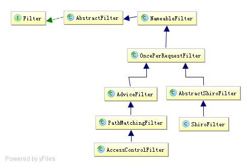

# 拦截器机制

## 8.1 拦截器介绍



1 、NameableFilter
NameableFilter给 Filter 起个名字，如果没有设置默认就是 FilterName；还记得之前的如 authc
吗？当我们组装拦截器链时会根据这个名字找到相应的拦截器实例；
2 、OncePerRequestFilter
OncePerRequestFilter 用于防止多次执行 Filter 的；也就是说一次请求只会走一次拦截器链；
另外提供 enabled 属性，表示是否开启该拦截器实例，默认 enabled=true 表示开启，如果不
想让某个拦截器工作，可以设置为 false 即可。
3 、ShiroFilter
ShiroFilter 是整个 Shiro 的入口点，用于拦截需要安全控制的请求进行处理，这个之前已经
用过了。
4 、AdviceFilter
AdviceFilter 提供了 AOP 风格的支持，类似于 SpringMVC 中的 Interceptor：

```java
boolean preHandle(ServletRequest request, ServletResponse response) throws Exception
void postHandle(ServletRequest request, ServletResponse response) throws Exception
void afterCompletion(ServletRequest request, ServletResponse response, Exception exception)
throws Exception;
```

preHandler：类似于 AOP 中的前置增强；在拦截器链执行之前执行；如果返回 true 则继续
拦截器链；否则中断后续的拦截器链的执行直接返回；进行预处理（如基于表单的身份验
证、授权）
postHandle：类似于 AOP 中的后置返回增强；在拦截器链执行完成后执行；进行后处理（如
记录执行时间之类的）；
afterCompletion：类似于 AOP 中的后置最终增强；即不管有没有异常都会执行；可以进行
清理资源（如接触 Subject 与线程的绑定之类的）；

5 、PathMatchingFilter
PathMatchingFilter 提供了基于 Ant 风格的请求路径匹配功能及拦截器参数解析的功能，如
“roles[admin,user]”自动根据“，”分割解析到一个路径参数配置并绑定到相应的路径：

```java
boolean pathsMatch(String path, ServletRequest request)
boolean onPreHandle(ServletRequest request, ServletResponse response, Object mappedValue)
throws Exception
```

pathsMatch：该方法用于 path 与请求路径进行匹配的方法；如果匹配返回 true；
onPreHandle：在 preHandle 中，当 pathsMatch 匹配一个路径后，会调用 opPreHandler 方法
并将路径绑定参数配置传给 mappedValue；然后可以在这个方法中进行一些验证（如角色
授权），如果验证失败可以返回 false 中断流程；默认返回 true；也就是说子类可以只实现
onPreHandle 即可，无须实现 preHandle。如果没有 path 与请求路径匹配，默认是通过的（即
preHandle 返回 true）。

6 、AccessControlFilter
AccessControlFilter 提供了访问控制的基础功能；比如是否允许访问/当访问拒绝时如何处理
等：

```java
abstract boolean isAccessAllowed(ServletRequest request, ServletResponse response, Object
mappedValue) throws Exception;
boolean onAccessDenied(ServletRequest request, ServletResponse response, Object
mappedValue) throws Exception;
abstract boolean onAccessDenied(ServletRequest request, ServletResponse response) throws
Exception;
```

sAccessAllowed：表示是否允许访问；mappedValue 就是[urls]配置中拦截器参数部分，如
果允许访问返回 true，否则 false；
onAccessDenied：表示当访问拒绝时是否已经处理了；如果返回 true 表示需要继续处理；
如果返回 false 表示该拦截器实例已经处理了，将直接返回即可。
onPreHandle 会自动调用这两个方法决定是否继续处理：

```java
boolean onPreHandle(ServletRequest request, ServletResponse response, Object mappedValue)
throws Exception {
return isAccessAllowed(request, response, mappedValue) || onAccessDenied(request,
response, mappedValue);
}
```

另外 AccessControlFilter 还提供了如下方法用于处理如登录成功后/重定向到上一个请求：

```java
void setLoginUrl(String loginUrl) //身份验证时使用，默认/login.jsp
String getLoginUrl()
Subject getSubject(ServletRequest request, ServletResponse response) //获取 Subject 实例
boolean isLoginRequest(ServletRequest request, ServletResponse response)//当前请求是否是登录请求
void saveRequestAndRedirectToLogin(ServletRequest request, ServletResponse response)
throws IOException //将当前请求保存起来并重定向到登录页面
void saveRequest(ServletRequest request) //将请求保存起来，如登录成功后再重定向回该请求
void redirectToLogin(ServletRequest request, ServletResponse response) //重定向到登录页面
```

比如基于表单的身份验证就需要使用这些功能。
到 此 基 本 的 拦 截 器 就 完 事 了 ， 如 果 我 们 想 进 行 访 问 访 问 的 控 制 就 可 以 继 承
AccessControlFilter；如果我们要添加一些通用数据我们可以直接继承 PathMatchingFilter。

## 8.2 拦截器链

Shiro 对 Servlet 容器的 FilterChain 进行了代理，即 ShiroFilter 在继续 Servlet 容器的 Filter
链的执行之前，通过 ProxiedFilterChain 对 Servlet 容器的 FilterChain 进行了代理；即先走
Shiro 自己的 Filter 体系，然后才会委托给 Servlet 容器的 FilterChain 进行 Servlet 容器级别
的 Filter 链执行；Shiro 的 ProxiedFilterChain 执行流程：1、先执行 Shiro 自己的 Filter 链；2、
再执行 Servlet 容器的 Filter 链（即原始的 Filter）。
而 ProxiedFilterChain 是通过 FilterChainResolver 根据配置文件中[urls]部分是否与请求的
URL 是否匹配解析得到的。

```java
FilterChain getChain(ServletRequest request, ServletResponse response, FilterChain
originalChain);
```

即传入原始的 chain 得到一个代理的 chain。

Shiro 内 部 提 供 了 一 个 路 径 匹 配 的 FilterChainResolver 实 现 ：PathMatchingFilterChainResolver，其根据[urls]中配置的 url 模式（默认 Ant 风格）=拦截器链和请求的 url 是否匹配来解析得到配置的拦截器链的；而 PathMatchingFilterChainResolver内部通过 FilterChainManager 维护着拦截器链，比如 DefaultFilterChainManager 实现维护着url 模式与拦截器链的关系。因此我们可以通过 FilterChainManager 进行动态动态增加 url模式与拦截器链的关系。
DefaultFilterChainManager 会默认添加 org.apache.shiro.web.filter.mgt.DefaultFilter 中声明的
拦截器：

```java
public enum DefaultFilter {
    anon(AnonymousFilter.class),
    authc(FormAuthenticationFilter.class),
    authcBasic(BasicHttpAuthenticationFilter.class),
    logout(LogoutFilter.class),
    noSessionCreation(NoSessionCreationFilter.class),
    perms(PermissionsAuthorizationFilter.class),
    port(PortFilter.class),
    rest(HttpMethodPermissionFilter.class),
    roles(RolesAuthorizationFilter.class),
    ssl(SslFilter.class),
    user(UserFilter.class);
}
```

如果要注册自定义拦截器，IniSecurityManagerFactory/WebIniSecurityManagerFactory 在启动
时 会 自 动 扫 描 ini 配 置 文 件 中 的 [filters]/[main] 部 分 并 注 册 这 些 拦 截 器 到
DefaultFilterChainManager；且创建相应的 url 模式与其拦截器关系链。如果使用 Spring 后
续章节会介绍如果注册自定义拦截器。
如果想自定义 FilterChainResolver，可以通过实现 WebEnvironment 接口完成：

```java
public class MyIniWebEnvironment extends IniWebEnvironment {
@Override
protected FilterChainResolver createFilterChainResolver() {
//在此处扩展自己的 FilterChainResolver
return super.createFilterChainResolver();
}
}
```

如果覆盖了 IniWebEnvironment 默认的 FilterChainResolver，需要自己来解析请求与
FilterChain 之间的关系。如果想动态实现 url-拦截器的注册，就可以通过实现此处的
FilterChainResolver 来完成，比如：

```java
//1、创建 FilterChainResolver
PathMatchingFilterChainResolver filterChainResolver =
new PathMatchingFilterChainResolver();
//2、创建 FilterChainManager
DefaultFilterChainManager filterChainManager = new DefaultFilterChainManager();
//3、注册 Filter
for(DefaultFilter filter : DefaultFilter.values()) {
filterChainManager.addFilter(
filter.name(), (Filter) ClassUtils.newInstance(filter.getFilterClass()));
}
//4、注册 URL-Filter 的映射关系
filterChainManager.addToChain("/login.jsp", "authc");
filterChainManager.addToChain("/unauthorized.jsp", "anon");
filterChainManager.addToChain("/**", "authc");
filterChainManager.addToChain("/**", "roles", "admin");
//5、设置 Filter 的属性
FormAuthenticationFilter authcFilter =
(FormAuthenticationFilter)filterChainManager.getFilter("authc");
authcFilter.setLoginUrl("/login.jsp");
RolesAuthorizationFilter rolesFilter =
(RolesAuthorizationFilter)filterChainManager.getFilter("roles");
rolesFilter.setUnauthorizedUrl("/unauthorized.jsp");
filterChainResolver.setFilterChainManager(filterChainManager);
return filterChainResolver;
```

此处自己去实现注册 filter，及 url 模式与 filter 之间的映射关系。可以通过定制
FilterChainResolver 或 FilterChainManager 来完成诸如动态 URL 匹配的实现。
然后再 web.xml 中进行如下配置 Environment：

```java
<context-param>
<param-name>shiroEnvironmentClass</param-name>
<param-value>com.xc.shiro.chapter8.web.env.MyIniWebEnvironment</para
m-value>
</context-param>
```

## 8.3 自定义拦截器

### 8.3.1 扩展 OncePerRequestFilter

OncePerRequestFilter 保证一次请求只调用一次 doFilterInternal，即如内部的 forward 不会再
多执行一次 doFilterInternal：

```java
public class MyOncePerRequestFilter extends OncePerRequestFilter {
    @Override
    protected void doFilterInternal(ServletRequest request, ServletResponse response, FilterChain chain) throws ServletException, IOException {
        System.out.println("=========once per request filter");
        chain.doFilter(request, response);
    }
}

```

然后再 shiro.ini 配置文件中：

```ini
[main]
myFilter1=com.xc.shiro.chapter8.web.filter.MyOncePerRequestFilter
[filters]
myFilter1=com.xc.shiro.chapter8.web.filter.MyOncePerRequestFilter
[urls]
/**=myFilter1
```

Filter 可以在[main]或[filters]部分注册，然后在[urls]部分配置 url 与 filter 的映射关系即可。

### 8.3.2  扩展 AdviceFilter

AdviceFilter 提供了 AOP 的功能，其实现和 SpringMVC 中的 Interceptor 思想一样

```java
public class MyAdviceFilter extends AdviceFilter {
    @Override
    protected boolean preHandle(ServletRequest request, ServletResponse response) throws Exception {
        System.out.println("====预处理/前置处理");
        return true;//返回false将中断后续拦截器链的执行
    }
    @Override
    protected void postHandle(ServletRequest request, ServletResponse response) throws Exception {
        System.out.println("====后处理/后置返回处理");
    }
    @Override
    public void afterCompletion(ServletRequest request, ServletResponse response, Exception exception) throws Exception {
        System.out.println("====完成处理/后置最终处理");
    }
}

```

preHandle：进行请求的预处理，然后根据返回值决定是否继续处理（true：继续过滤器链）；
可以通过它实现权限控制；
postHandle：执行完拦截器链之后正常返回后执行；
afterCompletion：不管最后有没有异常，afterCompletion 都会执行，完成如清理资源功能。

然后在 shiro.ini 中进行如下配置：

```ini
[filters]
myFilter1=com.github.zhangkaitao.shiro.chapter8.web.filter.MyOncePerRequestFilter
myFilter2=com.github.zhangkaitao.shiro.chapter8.web.filter.MyAdviceFilter
[urls]
/**=myFilter1,myFilter2
```

### 8.3.3 PathMatchingFilter

PathMatchingFilter 继承了 AdviceFilter，提供了 url 模式过滤的功能，如果需要对指定的请
求进行处理，可以扩展 PathMatchingFilter：

```java
public class MyPathMatchingFilter extends PathMatchingFilter {

    @Override
    protected boolean onPreHandle(ServletRequest request, ServletResponse response, Object mappedValue) throws Exception {
        System.out.println("url matches,config is " + Arrays.toString((String[])mappedValue));
        return true;
    }
}
```

preHandle：会进行 url 模式与请求 url 进行匹配，如果匹配会调用 onPreHandle；如果没有
配置 url 模式/没有 url 模式匹配，默认直接返回 true；
onPreHandle：如果 url 模式与请求 url 匹配，那么会执行 onPreHandle，并把该拦截器配置
的参数传入。默认什么不处理直接返回 true。
然后在 shiro.ini 中进行如下配置:

```ini
[filters]
myFilter3=com.github.zhangkaitao.shiro.chapter8.web.filter.MyPathMatchingFilter
[urls]
/**= myFilter3[config]
```

/**就是注册给 PathMatchingFilter 的 url 模式，config 就是拦截器的配置参数，多个之间逗
号分隔，onPreHandle 使用 mappedValue 接收参数值。

### 8.3.4 扩展 AccessControlFilter

AccessControlFilter 继承了 PathMatchingFilter，并扩展了了两个方法：

```java
  public boolean onPreHandle(ServletRequest request, ServletResponse response, Object mappedValue) throws Exception {
        return this.isAccessAllowed(request, response, mappedValue) || this.onAccessDenied(request, response, mappedValue);
    }
```

isAccessAllowed：即是否允许访问，返回 true 表示允许；
onAccessDenied：表示访问拒绝时是否自己处理，如果返回 true 表示自己不处理且继续拦
截器链执行，返回 false 表示自己已经处理了（比如重定向到另一个页面）。

```java
public class MyAccessControlFilter extends AccessControlFilter {
    @Override
    protected boolean isAccessAllowed(ServletRequest request, ServletResponse response, Object mappedValue) throws Exception {
        System.out.println("access allowed");
        return true;
    }
    @Override
    protected boolean onAccessDenied(ServletRequest request, ServletResponse response) throws Exception {
        System.out.println("访问拒绝也不自己处理，继续拦截器链的执行");
        return true;
    }
}
```

然后在 shiro.ini 中进行如下配置：

```ini
[filters]
myFilter4=com.github.zhangkaitao.shiro.chapter8.web.filter.MyAccessControlFilter
[urls]
/**=myFilter4
```

### 8.3.5 基于表单拦截器

之前我们已经使用过 Shiro 内置的基于表单登录的拦截器了，此处自己做一个类似的基于
表单登录的拦截器。

```java
public class FormLoginFilter extends PathMatchingFilter {

    private String loginUrl = "/login.jsp";
    private String successUrl = "/";

    @Override
    protected boolean onPreHandle(ServletRequest request, ServletResponse response, Object mappedValue) throws Exception {
        if(SecurityUtils.getSubject().isAuthenticated()) {
            return true;//已经登录过
        }
        HttpServletRequest req = (HttpServletRequest) request;
        HttpServletResponse resp = (HttpServletResponse) response;
        if(isLoginRequest(req)) {
            if("post".equalsIgnoreCase(req.getMethod())) {//form表单提交
                boolean loginSuccess = login(req); //登录
                if(loginSuccess) {
                    return redirectToSuccessUrl(req, resp);
                }
            }
            return true;//继续过滤器链
        } else {//保存当前地址并重定向到登录界面
            saveRequestAndRedirectToLogin(req, resp);
            return false;
        }
    }

    private boolean redirectToSuccessUrl(HttpServletRequest req, HttpServletResponse resp) throws IOException {
        WebUtils.redirectToSavedRequest(req, resp, successUrl);
        return false;
    }

    private void saveRequestAndRedirectToLogin(HttpServletRequest req, HttpServletResponse resp) throws IOException {
        WebUtils.saveRequest(req);
        WebUtils.issueRedirect(req, resp, loginUrl);
    }

    private boolean login(HttpServletRequest req) {
        String username = req.getParameter("username");
        String password = req.getParameter("password");
        try {
            SecurityUtils.getSubject().login(new UsernamePasswordToken(username, password));
        } catch (Exception e) {
            req.setAttribute("shiroLoginFailure", e.getClass());
            return false;
        }
        return true;
    }

    private boolean isLoginRequest(HttpServletRequest req) {
        return pathsMatch(loginUrl, WebUtils.getPathWithinApplication(req));
    }
}
```

onPreHandle 主要流程：

1、首先判断是否已经登录过了，如果已经登录过了继续拦截器链即可；
2、如果没有登录，看看是否是登录请求，如果是 get 方法的登录页面请求，则继续拦截器
链（到请求页面），否则如果是 get 方法的其他页面请求则保存当前请求并重定向到登录
页面；
3、如果是 post 方法的登录页面表单提交请求，则收集用户名/密码登录即可，如果失败了
保存错误消息到“shiroLoginFailure”并返回到登录页面；
4、如果登录成功了，且之前有保存的请求，则重定向到之前的这个请求，否则到默认的成
功页面。

shiro.ini 配置

```ini
[filters]
anyRoles=com.github.zhangkaitao.shiro.chapter8.web.filter.AnyRolesFilter
[urls]
/test.jsp=formLogin,anyRoles[admin,user]
/login.jsp=formLogin
```

此处可以继承 AuthorizationFilter 实现，其提供了授权相关的基础代码。另外可以参考 Shiro
内嵌的 RolesAuthorizationFilter 的源码，只是实现 hasAllRoles 逻辑。

## 8.4 默认拦截器

Shiro 内置了很多默认的拦截器，比如身份验证、授权等相关的。默认拦截器可以参考
org.apache.shiro.web.filter.mgt.DefaultFilter 中的枚举拦截器：