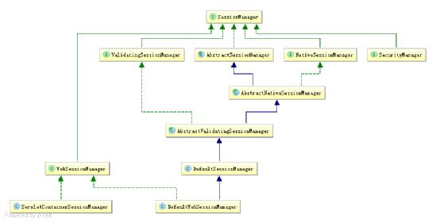
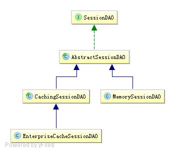

# 会话管理

Shiro 提供了完整的企业级会话管理功能，不依赖于底层容器（如 web 容器 tomcat），不管
JavaSE 还是 JavaEE 环境都可以使用，提供了会话管理、会话事件监听、会话存储/持久化、
容器无关的集群、失效/过期支持、对 Web 的透明支持、SSO 单点登录的支持等特性。即
直接使用 Shiro 的会话管理可以直接替换如 Web 容器的会话管理。

## 10.1 会话

所谓会话，即用户访问应用时保持的连接关系，在多次交互中应用能够识别出当前访问的
用户是谁，且可以在多次交互中保存一些数据。如访问一些网站时登录成功后，网站可以
记住用户，且在退出之前都可以识别当前用户是谁。

Shiro 的会话支持不仅可以在普通的 JavaSE 应用中使用，也可以在 JavaEE 应用中使用，如
web 应用。且使用方式是一致的。

```java
login("classpath:shiro.ini", "zhang", "123");
Subject subject = SecurityUtils.getSubject();
Session session = subject.getSession();
```

登录成功后使用 Subject.getSession()即可获取会话；其等价于 Subject.getSession(true)，即如
果当前没有创建 Session 对象会创建一个；另外 Subject.getSession(false)，如果当前没有创
建 Session 则返回 null（不过默认情况下如果启用会话存储功能的话在创建 Subject 时会主
动创建一个 Session）。

```java
session.getId();
```

获取当前会话的唯一标识。

```java
session.getHost();
```

获取当前 Subject 的主机地址，该地址是通过 HostAuthenticationToken.getHost()提供的。

```java
session.getTimeout();
session.setTimeout(毫秒);
```

获取/设置当前 Session 的过期时间；如果不设置默认是会话管理器的全局过期时间。

```java
session.getStartTimestamp();
session.getLastAccessTime();
```

获取会话的启动时间及最后访问时间；如果是 JavaSE 应用需要自己定期调用 session.touch()
去更新最后访问时间；如果是 Web 应用，每次进入 ShiroFilter 都会自动调用 session.touch()
来更新最后访问时间。

```java
session.touch();
session.stop();
```

更新会话最后访问时间及销毁会话；当 Subject.logout()时会自动调用 stop 方法来销毁会话。
如果在web中，调用javax.servlet.http.HttpSession. invalidate()也会自动调用Shiro Session.stop
方法进行销毁 Shiro 的会话。

```java
session.setAttribute("key", "123");
Assert.assertEquals("123", session.getAttribute("key"));
session.removeAttribute("key");
```

设置/获取/删除会话属性；在整个会话范围内都可以对这些属性进行操作。

Shiro 提供的会话可以用于 JavaSE/JavaEE 环境，不依赖于任何底层容器，可以独立使用，
是完整的会话模块。

## 10.2 会话管理器

会话管理器管理着应用中所有 Subject 的会话的创建、维护、删除、失效、验证等工作。是
Shiro 的核心组件，顶层组件 SecurityManager 直接继承了 SessionManager，且提供了
SessionsSecurityManager 实 现 直 接 把 会 话 管 理 委 托 给 相 应 的 SessionManager ，
DefaultSecurityManager 及 DefaultWebSecurityManager 默认 SessionManager 都继承了
SessionsSecurityManager。

SessionManager 提供了如下接口：

```java
Session start(SessionContext context); //启动会话
Session getSession(SessionKey key) throws SessionException; //根据会话 Key 获取会话
```

另外用于 Web 环境的 WebSessionManager 又提供了如下接口：

```java
boolean isServletContainerSessions();//是否使用 Servlet 容器的会话
```

Shiro 还提供了 ValidatingSessionManager 用于验资并过期会话：

```java
void validateSessions();//验证所有会话是否过期
```



Shiro 提供了三个默认实现：
**DefaultSessionManager**：DefaultSecurityManager 使用的默认实现，用于 JavaSE 环境；
**ServletContainerSessionManager**：DefaultWebSecurityManager 使用的默认实现，用于 Web环境，其直接使用 Servlet 容器的会话；
**DefaultWebSessionManager** ： 用 于 Web 环 境 的 实 现 ， 可 以 替 代ServletContainerSessionManager，自己维护着会话，直接废弃了 Servlet 容器的会话管理。


替换 SecurityManager 默认的 SessionManager 可以在 ini 中配置（shiro.ini）：

```ini
[main]
sessionManager=org.apache.shiro.session.mgt.DefaultSessionManager
securityManager.sessionManager=$sessionManager
```

Web 环境下的 ini 配置(shiro-web.ini)：

```ini
[main]
sessionManager=org.apache.shiro.web.session.mgt.ServletContainerSessionManager
securityManager.sessionManager=$sessionManager
```

另外可以设置会话的全局过期时间（毫秒为单位），默认 30 分钟：

```ini
sessionManager. globalSessionTimeout=1800000
```

默认情况下 globalSessionTimeout 将应用给所有 Session。可以单独设置每个 Session 的
timeout 属性来为每个 Session 设置其超时时间。
另外如果使用 ServletContainerSessionManager 进行会话管理，Session 的超时依赖于底层
Servlet 容器的超时时间，可以在 web.xml 中配置其会话的超时时间（分钟为单位）：

```xml
<session-config>
<session-timeout>30</session-timeout>
</session-config>
```

在 Servlet 容器中，默认使用 JSESSIONID Cookie 维护会话，且会话默认是跟容器绑定的；
在某些情况下可能需要使用自己的会话机制，此时我们可以使用DefaultWebSessionManager
来维护会话：

```ini
sessionIdCookie=org.apache.shiro.web.servlet.SimpleCookie
sessionManager=org.apache.shiro.web.session.mgt.DefaultWebSessionManager
sessionIdCookie.name=sid
#sessionIdCookie.domain=sishuok.com
#sessionIdCookie.path=
sessionIdCookie.maxAge=1800
sessionIdCookie.httpOnly=true
sessionManager.sessionIdCookie=$sessionIdCookie
sessionManager.sessionIdCookieEnabled=true
securityManager.sessionManager=$sessionManager
```

sessionIdCookie 是 sessionManager 创建会话 Cookie 的模板：
sessionIdCookie.name：设置 Cookie 名字，默认为 JSESSIONID；
sessionIdCookie.domain：设置 Cookie 的域名，默认空，即当前访问的域名；
sessionIdCookie.path：设置 Cookie 的路径，默认空，即存储在域名根下；
sessionIdCookie.maxAge：设置 Cookie 的过期时间，秒为单位，默认-1 表示关闭浏览器时
过期 Cookie；
sessionIdCookie.httpOnly：如果设置为 true，则客户端不会暴露给客户端脚本代码，使用
HttpOnly cookie有助于减少某些类型的跨站点脚本攻击；此特性需要实现了Servlet 2.5 MR6
及以上版本的规范的 Servlet 容器支持；
sessionManager.sessionIdCookieEnabled：是否启用/禁用 Session Id Cookie，默认是启用的；
如果禁用后将不会设置 Session Id Cookie，即默认使用了 Servlet 容器的 JSESSIONID，且通
过 URL 重写（URL 中的“;JSESSIONID=id”部分）保存 Session Id。

另外我们可以如“sessionManager. sessionIdCookie.name=sid”这种方式操作 Cookie 模板。

## 10.3 会话监听器

会话监听器用于监听会话创建、过期及停止事件：

```java
public class MySessionListener1 implements SessionListener {
@Override
public void onStart(Session session) {//会话创建时触发
System.out.println("会话创建：" + session.getId());
}
@Override
public void onExpiration(Session session) {//会话过期时触发
System.out.println("会话过期：" + session.getId());
}
@Override
public void onStop(Session session) {//退出/会话过期时触发
System.out.println("会话停止：" + session.getId());
}
}
```

如果只想监听某一个事件，可以继承 SessionListenerAdapter 实现：

```java
public class MySessionListener2 extends SessionListenerAdapter {
@Override
public void onStart(Session session) {
System.out.println("会话创建：" + session.getId());
}
}
```

在 shiro-web.ini 配置文件中可以进行如下配置设置会话监听器：

```ini
sessionListener1=com.xc.shiro.chapter10.web.listener.MySessionListener1
sessionListener2=com.xc.shiro.chapter10.web.listener.MySessionListener2
sessionManager.sessionListeners=$sessionListener1,$sessionListener2
```

## 10.4 会话存储/持久化

Shiro 提供 SessionDAO 用于会话的 CRUD，即 DAO（Data Access Object）模式实现：

```java
//如 DefaultSessionManager 在创建完 session 后会调用该方法；如保存到关系数据库/文件系统/NoSQL 数据库；即可以实现会话的持久化；返回会话 ID；主要此处返回的
ID.equals(session.getId())；
Serializable create(Session session);
//根据会话 ID 获取会话
Session readSession(Serializable sessionId) throws UnknownSessionException;
//更新会话；如更新会话最后访问时间/停止会话/设置超时时间/设置移除属性等会调用
void update(Session session) throws UnknownSessionException;
//删除会话；当会话过期/会话停止（如用户退出时）会调用
void delete(Session session);
//获取当前所有活跃用户，如果用户量多此方法影响性能
```

Shiro 内嵌了如下 SessionDAO 实现：



AbstractSessionDAO提供了SessionDAO的基础实现，如生成会话ID等；CachingSessionDAO
提供了对开发者透明的会话缓存的功能，只需要设置相应的 CacheManager 即可；
MemorySessionDAO 直接在内存中进行会话维护；而 EnterpriseCacheSessionDAO 提供了缓
存功能的会话维护，默认情况下使用 MapCache 实现，内部使用 ConcurrentHashMap 保存
缓存的会话。
可以通过如下配置设置 SessionDAO：

```ini
sessionDAO=org.apache.shiro.session.mgt.eis.EnterpriseCacheSessionDAO
sessionManager.sessionDAO=$sessionDAO
```

Shiro 提供了使用 Ehcache 进行会话存储，Ehcache 可以配合 TerraCotta 实现容器无关的分
布式集群。
首先在 pom.xml 里添加如下依赖：

```xml
<dependency>
            <groupId>org.apache.shiro</groupId>
            <artifactId>shiro-ehcache</artifactId>
            <version>1.2.2</version>
        </dependency>
```

接着配置 shiro-web.ini 文件：

```ini
sessionDAO=org.apache.shiro.session.mgt.eis.EnterpriseCacheSessionDAO
sessionDAO. activeSessionsCacheName=shiro-activeSessionCache
sessionManager.sessionDAO=$sessionDAO
cacheManager = org.apache.shiro.cache.ehcache.EhCacheManager
cacheManager.cacheManagerConfigFile=classpath:ehcache.xml
securityManager.cacheManager = $cacheManager
```

sessionDAO. activeSessionsCacheName ： 设 置 Session 缓 存 名 字 ， 默 认 就 是
shiro-activeSessionCache；
cacheManager：缓存管理器，用于管理缓存的，此处使用 Ehcache 实现；
cacheManager.cacheManagerConfigFile：设置 ehcache 缓存的配置文件；
securityManager.cacheManager：设置 SecurityManager 的 cacheManager，会自动设置实现了
CacheManagerAware 接口的相应对象，如 SessionDAO 的 cacheManager；
然后配置 ehcache.xml：

```xml-dtd
<?xml version="1.0" encoding="UTF-8"?>
<ehcache name="es">

    <diskStore path="java.io.tmpdir"/>

    <cache name="shiro-activeSessionCache"
           maxEntriesLocalHeap="10000"
           overflowToDisk="false"
           eternal="false"
           diskPersistent="false"
           timeToLiveSeconds="0"
           timeToIdleSeconds="0"
           statistics="true"/>

</ehcache>
```

Cache 的名字为 shiro-activeSessionCache，即设置的 sessionDAO 的 activeSessionsCacheName
属性值。

另外可以通过如下 ini 配置设置会话 ID 生成器

```ini
sessionIdGenerator=org.apache.shiro.session.mgt.eis.JavaUuidSessionIdGenerator
sessionDAO.sessionIdGenerator=$sessionIdGenerator
```

用于生成会话 ID，默认就是 JavaUuidSessionIdGenerator，使用 java.util.UUID 生成。

如果自定义实现 SessionDAO，继承 CachingSessionDAO 即可：

```java
public class MySessionDao extends CachingSessionDAO{

    private JdbcTemplate jdbcTemplate = JdbcTemplateUtils.jdbcTemplate();

    @Override
    protected void doUpdate(Session session) {
        if(session instanceof ValidatingSession && !((ValidatingSession)session).isValid()) {
            return; //如果会话过期/停止 没必要再更新了
        }
        String sql = "update sessions set session=? where id=?";
        jdbcTemplate.update(sql, SerializableUtils.serialize(session), session.getId());
    }

    @Override
    protected void doDelete(Session session) {
        String sql = "delete from sessions where id=?";
        jdbcTemplate.update(sql, session.getId());
    }

    @Override
    protected Serializable doCreate(Session session) {
        Serializable sessionId = generateSessionId(session);
        assignSessionId(session, sessionId);
        String sql = "insert into sessions(id, session) values(?,?)";
        jdbcTemplate.update(sql, sessionId, SerializableUtils.serialize(session));
        return session.getId();
    }

    @Override
    protected Session doReadSession(Serializable sessionId) {
        String sql = "select session from sessions where id=?";
        List<String> sessionStrList = jdbcTemplate.queryForList(sql, String.class, sessionId);
        if(sessionStrList.size() == 0) {
            return null;
        }
        return SerializableUtils.deserialize(sessionStrList.get(0));
    }
}

```

doCreate/doUpdate/doDelete/doReadSession 分别代表创建/修改/删除/读取会话；此处通过把
会话序列化后存储到数据库实现；接着在 shiro-web.ini 中配置：

```ini
sessionDAO=com.github.zhangkaitao.shiro.chapter10.session.dao.MySessionDAO
```

其他设置和之前一样，因为继承了 CachingSessionDAO；所有在读取时会先查缓存中是否
存在，如果找不到才到数据库中查找。

## 10.5 会话验证

Shiro 提供了会话验证调度器，用于定期的验证会话是否已过期，如果过期将停止会话；出
于性能考虑，一般情况下都是获取会话时来验证会话是否过期并停止会话的；但是如在 web
环境中，如果用户不主动退出是不知道会话是否过期的，因此需要定期的检测会话是否过
期，Shiro 提供了会话验证调度器 SessionValidationScheduler 来做这件事情。
可以通过如下 ini 配置开启会话验证：

```ini
sessionValidationScheduler=org.apache.shiro.session.mgt.ExecutorServiceSessionValidationSc
heduler
sessionValidationScheduler.interval = 3600000
sessionValidationScheduler.sessionManager=$sessionManager
sessionManager.globalSessionTimeout=1800000
sessionManager.sessionValidationSchedulerEnabled=true
sessionManager.sessionValidationScheduler=$sessionValidationScheduler
```

sessionValidationScheduler ： 会 话 验 证 调 度 器 ， sessionManager 默 认 就 是 使 用
ExecutorServiceSessionValidationScheduler，其使用 JDK 的 ScheduledExecutorService 进行定
期调度并验证会话是否过期；
sessionValidationScheduler.interval：设置调度时间间隔，单位毫秒，默认就是 1 小时；
sessionValidationScheduler.sessionManager：设置会话验证调度器进行会话验证时的会话管
理器；
sessionManager.globalSessionTimeout：设置全局会话超时时间，默认 30 分钟，即如果 30
分钟内没有访问会话将过期；
sessionManager.sessionValidationSchedulerEnabled：是否开启会话验证器，默认是开启的；
sessionManager.sessionValidationScheduler ： 设 置 会 话 验 证 调 度 器 ， 默 认 就 是 使 用
ExecutorServiceSessionValidationScheduler。
Shiro 也提供了使用 Quartz 会话验证调度器：

```ini
sessionValidationScheduler=org.apache.shiro.session.mgt.quartz.QuartzSessionValidationSched
uler
sessionValidationScheduler.sessionValidationInterval = 3600000
sessionValidationScheduler.sessionManager=$sessionManager
```

使用时需要导入 shiro-quartz 依赖：

```xml
 <dependency>
            <groupId>org.apache.shiro</groupId>
            <artifactId>shiro-quartz</artifactId>
            <version>1.2.2</version>
        </dependency>
```

如 上 会 话 验 证 调 度 器 实 现 都 是 直 接 调 用 AbstractValidatingSessionManager 的
validateSessions 方法进行验证，其直接调用 SessionDAO 的 getActiveSessions 方法获取所有
会话进行验证，如果会话比较多，会影响性能；可以考虑如分页获取会话并进行验证，如
com.xc.shiro.chapter10.session.scheduler.MySessionValidationScheduler：

```java
  //分页获取会话并验证
        String sql = "select session from sessions limit ?,?";
        int start = 0; //起始记录
        int size = 20; //每页大小
        List<String> sessionList = jdbcTemplate.queryForList(sql, String.class, start, size);
        while(sessionList.size() > 0) {
            for(String sessionStr : sessionList) {
                try {
                    Session session = SerializableUtils.deserialize(sessionStr);
                    Method validateMethod = ReflectionUtils.findMethod(AbstractValidatingSessionManager.class, "validate", Session.class, SessionKey.class);
                    validateMethod.setAccessible(true);
                    ReflectionUtils.invokeMethod(validateMethod, sessionManager, session, new DefaultSessionKey(session.getId()));
                } catch (Exception e) {
                    //ignore
                }
            }
            start = start + size;
            sessionList = jdbcTemplate.queryForList(sql, String.class, start, size);
        }
```

其直接改造自 ExecutorServiceSessionValidationScheduler，如上代码是验证的核心代码，可以根据自己的需求改造此验证调度器器；ini 的配置和之前的类似。
如果在会话过期时不想删除过期的会话，可以通过如下 ini 配置进行设置：

```ini
sessionManager.deleteInvalidSessions=false
```

默认是开启的，在会话过期后会调用 SessionDAO 的 delete 方法删除会话：如会话时持久化
存储的，可以调用此方法进行删除。
如果是在获取会话时验证了会话已过期，将抛出 InvalidSessionException；因此需要捕获这
个异常并跳转到相应的页面告诉用户会话已过期，让其重新登录，如可以在 web.xml 配置
相应的错误页面：

```xml
<error-page>
<exception-type>org.apache.shiro.session.InvalidSessionException</exception-type>
<location>/invalidSession.jsp</location>
</error-page>
```

## 10.6 sessionFactory

sessionFactory 是创建会话的工厂，根据相应的 Subject 上下文信息来创建会话；默认提供
了 SimpleSessionFactory 用来创建 SimpleSession 会话。
首先自定义一个 Session：

```java
public class OnlineSession extends SimpleSession {
public static enum OnlineStatus {
on_line("在线"), hidden("隐身"), force_logout("强制退出");
private final String info;
private OnlineStatus(String info) {
this.info = info;
}
public String getInfo() {
return info;
}
}
private String userAgent; //用户浏览器类型
private OnlineStatus status = OnlineStatus.on_line; //在线状态
private String systemHost; //用户登录时系统 IP
//省略其他
```

OnlineSession 用于保存当前登录用户的在线状态，支持如离线等状态的控制。

接着自定义 SessionFactory：

```java
public class OnlineSessionFactory implements SessionFactory {
@Override
public Session createSession(SessionContext initData) {
OnlineSession session = new OnlineSession();
if (initData != null && initData instanceof WebSessionContext) {
WebSessionContext sessionContext = (WebSessionContext) initData;
HttpServletRequest request = (HttpServletRequest)
sessionContext.getServletRequest();
if (request != null) {
session.setHost(IpUtils.getIpAddr(request));
session.setUserAgent(request.getHeader("User-Agent"));
session.setSystemHost(request.getLocalAddr() + ":" +
request.getLocalPort());
}
}
return session;
}
}
```

根据会话上下文创建相应的 OnlineSession。
最后在 shiro-web.ini 配置文件中配置：

```ini
sessionFactory=org.apache.shiro.session.mgt.OnlineSessionFactory
sessionManager.sessionFactory=$sessionFactory
```

